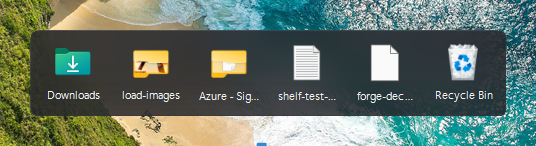

<p align="center">
  
</p>

<h1 align="center">Shelf</h1>

<p align="center">
  <strong>A macOS-style Downloads stack for the Windows 11 taskbar.</strong><br>
  Click the folder, see what just landed, drag it wherever it belongs.
</p>

<p align="center">
  
</p>

<p align="center">
  
  
  
  
</p>

---

Windows 11 has no way to get at your downloads from the taskbar. The feature that
came closest, taskbar toolbars, which could pin a folder you could expand and
drag out of, was removed in Windows 11 and there is no setting that brings it
back.

Shelf puts it back. It sits in the taskbar as one more icon, at the end of your
app cluster. Click it and a frosted panel rises above the bar with whatever is
in your Downloads folder, newest last, right beside the Recycle Bin.

## What it does

- **Drag files out.** Onto the desktop, into Explorer, into a chat window,
  anywhere that accepts a file. The file's own icon follows the cursor.
- **Drag files in.** Drop anything on the panel and it moves into Downloads,
  Ctrl to copy.
- **Drop on the bin** to recycle, undoably, because it goes through the shell
  rather than deleting outright.
- **Folders too**, not just files, with their real Explorer icons.
- **Live.** A watcher updates the grid the moment something downloads, and the
  icon gives a small bounce.
- **Gets out of the way** when anything goes fullscreen.

## Install

Download `shelf.exe` from the [Releases](../../releases) page and run it, or build
it yourself:

```powershell
git clone https://github.com/rui-branco/shelf.git
cd shelf
.\install.ps1
```

`install.ps1` builds, puts the executable in `%LOCALAPPDATA%\Shelf`, adds a Start
Menu shortcut and starts it. Install it somewhere permanent like that rather than
running it out of `bin`: both **Start with Windows** and the updater work against
the running executable's own path, so a build output that later moves breaks them.

Right-click the icon for **Start with Windows** to have it there on every login.

## Build

```powershell
.\build.ps1
```

No SDK, no NuGet, no project file. It compiles with the C# compiler that already
ships inside Windows (`C:\Windows\Microsoft.NET\Framework64\v4.0.30319\csc.exe`)
and produces one ~80&nbsp;KB executable with no dependencies. `tools\make-icon.ps1`
draws the icon from code, so there are no binary image files in the repository
either.

## Using it

| Action | Result |
| --- | --- |
| Click the taskbar icon | Open and close the stack |
| Click a tile | Open that file or folder |
| Drag a tile out | Move or copy it anywhere |
| Drag a file onto the panel | Move it into Downloads (Ctrl to copy) |
| Drop a tile on the Recycle Bin | Send it to the bin |
| Right-click a tile | Open, Show in folder, Copy, Delete |
| Right-click the taskbar icon | Open Downloads, Start with Windows, Check for updates, Quit |
| <kbd>Esc</kbd> | Close the stack, or cancel a drag |

Settings live in `%APPDATA%\Shelf\config.json`: which folder to watch, how many
items to show, and the tile size.

## Updates

Right-click the icon and choose **Check for updates**. Shelf also looks once at
startup, quietly: if a newer release is out, that item reads **Update to Shelf
1.1.0** the next time you open the menu, and the version it is running is written
at the foot of the menu either way.

Updating downloads that release's `shelf.exe`, moves the running build aside,
swaps the new one in and restarts. Windows will not let a running executable be
overwritten, but it will let it be renamed, and the build that stepped aside is
swept up on the next start.

The repository is pinned in the source rather than read from config: an updater
that can be pointed elsewhere by a settings file is a way to make Shelf run
someone else's code. A release is only offered if it is not a draft or a
prerelease and has a `shelf.exe` attached, and the download is rejected unless it
really is a program.

## Known limits

- **It cannot reserve space on the taskbar.** Only a shell extension can do
  that, and Windows 11 dropped the interface. Shelf is a floating window that
  keeps itself positioned after your last app icon, so it moves as the cluster
  re-centres.
- **It hides while the Start menu is open.** Parenting into the taskbar would
  fix that, and does, but the taskbar's XAML layer then owns hit testing and the
  icon becomes visible and unclickable. Being clickable matters more.
- **The panel's blur is a snapshot** taken as it opens, so it does not track
  content moving behind it. For a panel that lives a few seconds, that is not
  worth a live capture.

## Licence

MIT. See [LICENSE](LICENSE).
